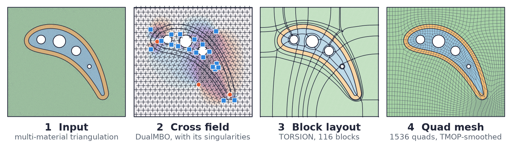
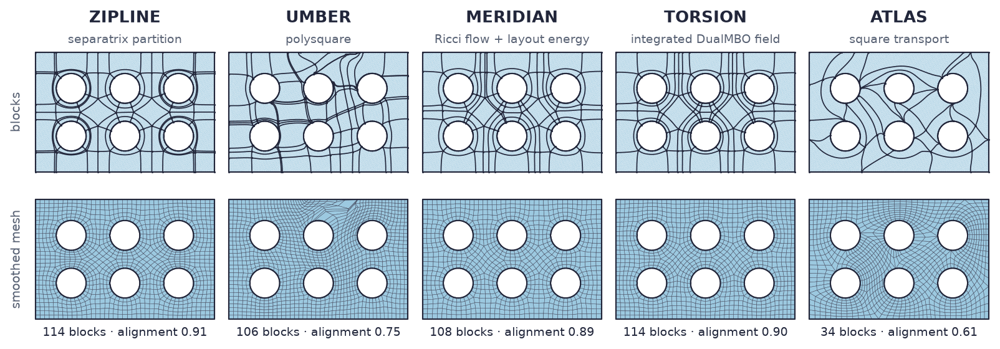
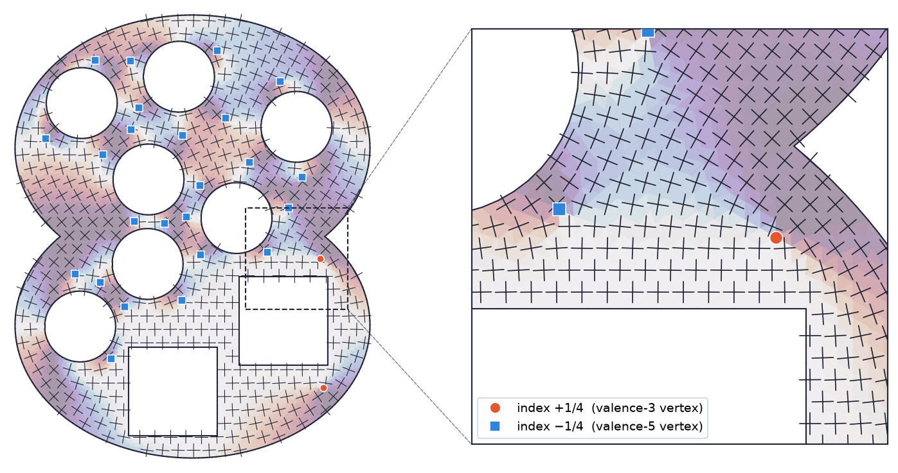
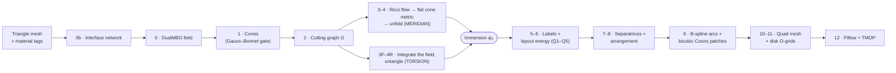
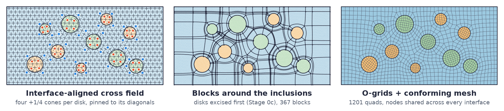
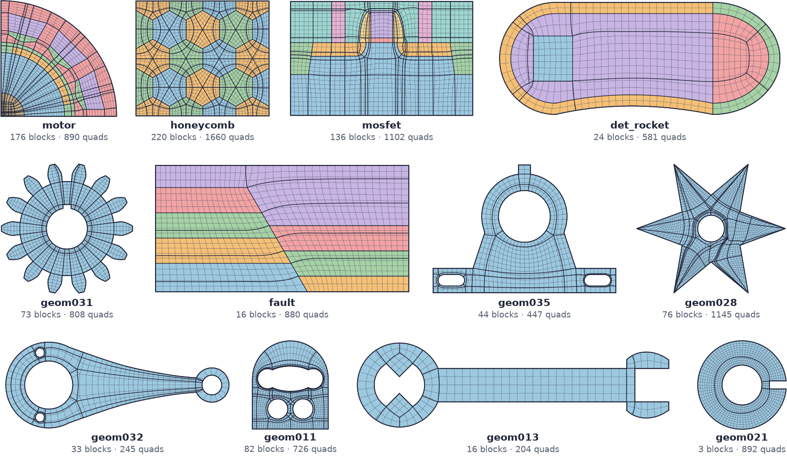

# CrossGen

**Cross fields, quad layouts and conforming quadrilateral meshes for planar, multi-material domains.**

<p align="center">
  
</p>

CrossGen turns a triangulated planar domain, with holes, sharp corners and any number of
material regions, into a **block decomposition**: a partition into a few four-sided blocks
whose sides follow the boundary and every material interface. From the blocks it builds a
conforming all-quadrilateral mesh. Every element lies inside one material, and the two sides
of an interface share their nodes. It smooths the mesh with TMOP and writes it out for
analysis (MFEM `.mesh` with the material as the element attribute, VTK, OBJ), or as a
watertight set of bicubic patches (STEP or BREP).

It is a C++17 research code behind an IMR 2027 paper. The paper's method is **DualMBO**, a
cross field computed by MBO threshold dynamics with one cross per *triangle*, so that its
singularities land on mesh vertices. DualMBO drives the quad-layout pipeline of Shepherd, Gu
and Hughes (2022). Around that core the repository has five complete layout methods that all
return the same `BlockDecomposition` class, a learned selector that picks among them for each
model, a Python module, and a Qt viewer.

**Contents:** [Highlights](#highlights) ·
[The layout methods](#the-layout-methods) · [How it works](#how-it-works) ·
[Gallery](#gallery) · [Building](#building) · [Running](#running) ·
[Repository layout](#repository-layout) · [References](#references)

## Highlights

- **DualMBO cross field.** MBO threshold dynamics on a piecewise-constant (p = 0) field over
  the triangles, with a consistent two-point diffusion operator and τ-continuation. Boundary
  and interface alignment are hard Dirichlet data.
- **Five layout methods, one output.** TORSION, MERIDIAN, ZIPLINE, UMBER and ATLAS each hand
  back a `mesh::BlockDecomposition`, graded by the same validity and quality metrics.
- **Multi-material domains.** Interfaces are features the layout must keep, and junctions are
  prescribed singularities. Circular inclusions are excised and refilled with O-grids. TORSION
  lays out each material region on its own and glues the layouts along the interfaces.
- **Meshing that respects the layout.** Interval counts are assigned per chord, patches are
  bicubic Coons patches, elements that span a flat feature corner are pillowed, and the TMOP
  smoother has a Garanzha-style untangler.
- **Geometry on OpenCASCADE.** B-splines, Coons patches and B-rep export live in one library,
  `src/geom`, and nothing else in the code base touches OpenCASCADE.
- **ORACLE.** A selector, trained on the five methods' own results and read with ONNX
  Runtime, chooses which method to run on a new model.
- **Python.** The `crossgen` extension module runs every method, mesher and metric on NumPy
  arrays.

## The layout methods

<p align="center">
  
</p>

| Method | How it finds the blocks | Field it uses | Based on | Code |
|---|---|---|---|---|
| **TORSION** | Shepherd et al.'s layout energy, started from a map made by *integrating* the DualMBO field: one constrained least-squares solve, then untangling. Lays out each material region separately and glues the regions together. | DualMBO | Shepherd, Gu & Hughes 2022, plus this work | `src/TORSION` |
| **MERIDIAN** | Shepherd et al. as published: cones, a cutting graph, discrete Ricci flow to a flat cone metric, the immersion, the layout energy, separatrices and bicubic Coons patches. | DualMBO (for the cones) | Shepherd, Gu & Hughes 2022 | `src/MERIDIAN` |
| **ZIPLINE** | Traces the separatrices of a cross field, simplifies the partition by chord collapses and stem extension, and keeps the four-sided faces as blocks. | P1 MBO | Viertel, Osting & Staten 2019 | `src/ZIPLINE` |
| **UMBER** | Builds a frame field with no interior singularities, then a closed-form polysquare, then cuts it with a motorcycle graph. | non-symmetric frame field | Wang et al. 2022 | `src/UMBER` |
| **ATLAS** | Square transport: splits every triangle into three quads with exact integer transitions, certifies rectangles by integer development, and searches for a conforming cover with few blocks. | DualMBO, as an optional prior | own design | `src/ATLAS` |
| **ORACLE** | Not a method of its own. Runs ZIPLINE as a cheap probe and asks a trained selector for a ranking. Keeps ZIPLINE if it ranks first; otherwise runs the top-ranked method and keeps the better of the two, with ATLAS as the fallback. | – | `py/train_classifier.py` | `src/ORACLE` |

No method wins everywhere. On the selector's training set (`py/build_dataset.py`, built
2026-10-02 from the 35 single-material corpus models and 407 planar faces of MAMBO CAD
parts), the share of runs that give a valid decomposition, and the mean
[alignment quality](#5-grading-a-decomposition) of the valid ones, were:

| | ZIPLINE | UMBER | MERIDIAN | TORSION | ATLAS |
|---|---:|---:|---:|---:|---:|
| valid, corpus | 0.89 | 0.81 | 0.94 | 0.97 | **1.00** |
| valid, MAMBO faces | 0.87 | 0.90 | 0.92 | 0.92 | **1.00** |
| alignment, corpus | **0.91** | 0.79 | 0.90 | 0.89 | 0.72 |
| alignment, MAMBO faces | **0.93** | 0.88 | 0.92 | 0.92 | 0.83 |

ATLAS is valid by construction, because its fine carrier is always a valid answer, but its
blocks follow the walls less closely. The field-guided methods align better and sometimes
fail. That trade-off is the reason ORACLE exists.

## How it works

### 1. The cross field: DualMBO

<p align="center">
  
</p>

A cross (four directions at right angles) is stored as one complex number
$u = e^{4i\theta}$. The fourth power forgets the quarter-turn ambiguity, so making a field of
crosses smooth becomes ordinary diffusion of $u$. DualMBO keeps one $u$ per **triangle**, a
piecewise-constant (p = 0) field on the dual mesh. It solves the Ginzburg–Landau problem by
MBO threshold dynamics, alternating a diffusion step with a projection back onto unit
crosses:

$$(M + \tau K)\,\hat u = M u^{k} + \tau b, \qquad u^{k+1} = \hat u / |\hat u| .$$

- **Alignment is Dirichlet data.** A triangle on the boundary, or on either side of a
  material interface, is pinned to $e^{4i\theta}$ of that edge's tangent. At a corner, where
  two edges ask for different crosses, the pin is weighted by how far their data agree.
- **The operator.** At p = 0 every gradient term of the interior-penalty form vanishes. What
  is left, $\sum_e \kappa_e [u][v]$, *is* the discrete Laplacian, so $\kappa_e$ is not a free
  stabilisation parameter. The textbook weight $\gamma |e| / \min(h_i, h_j)$ fails the
  consistency test: applied to a linear field it leaves a relative residual of 0.37 over the
  corpus. The default is the two-point finite-volume weight $|e| / d_e$, where $d_e$ is the
  distance between the two circumcentres. It is exact on linear fields.
- **τ-continuation.** The diffusion time starts at $\tau_0 = D^2/10$, with $D$ the
  bounding-box diagonal. It shrinks level by level until one step diffuses over only a few
  elements, and each level starts from the field the previous level left.
- **Singularities sit on vertices.** Around the ring of triangles at a vertex, the field
  turns by a whole number of quarter turns. An index of $+1/4$ becomes a valence-3 vertex of
  the final layout and $-1/4$ a valence-5 vertex. Their total is fixed by the topology:
  counted in quarter turns over interior and boundary vertices, the cone indices must sum to
  $4\chi$ (the discrete Gauss–Bonnet condition), and Stage 1 checks that before anything
  downstream runs.
- **Disks.** A circular component is rotationally symmetric, so nothing in the boundary data
  decides where its four cones go. Pinning the centre triangle to $u = 1$ puts them on the
  diagonals, at 45° + k·90°, the same way on every run.

The baselines are B1, the same MBO with crosses on vertices (`src/crossfield`), and B2,
polyvector fields (`src/polyvector`).

### 2. From a field to a layout: MERIDIAN and TORSION

Shepherd, Gu and Hughes recast a quad layout as one map $\Psi : S - G \to \mathbb{R}^2$, from
the domain cut open along a graph $G$ into the plane, that satisfies five properties (their
Definition 2.1):

| | Property | Enforced by |
|---|---|---|
| Q1 | locally injective away from the cones | the starting map, kept by the symmetric Dirichlet barrier E1 |
| Q2 | cone angles are multiples of π/2 | the flat cone metric and E4 |
| Q3 | each boundary or feature chain maps to an axis-parallel line | E2 and E3 |
| Q4 | the transition across each seam is a rotation by kπ/2 plus a translation | the starting map and E4 |
| Q5 | every separatrix ends at a cone or at the boundary | E5, through the Γ_topo constraints |

This turns a combinatorial problem into a continuous one, but it needs a starting map that
already satisfies Q1, because the barrier can stop a triangle from flipping but cannot unflip
one. The two pipelines differ only in where that map comes from. Both fill an `Immersion`,
and every stage after it is shared code:



- **MERIDIAN** (Stages 3–4) runs discrete surface Ricci flow to a flat metric whose curvature
  is zero everywhere except $(\pi/2)\,I(v)$ at the cones, then unfolds that metric into the
  plane one triangle at a time.
- **TORSION** (Stages 3F–4R) integrates the DualMBO field instead. It combs the field, moves
  its singularities onto the cone set, and reads the matchings. Then one constrained
  least-squares solve on the cut domain holds the seam transitions and the axis of every
  boundary and interface chain as equalities. The transitions come out exact rather than
  fitted, and the alignment is exact rather than penalised. The price is local injectivity: a
  discrete cross field is generically not integrable, so an untangling ladder restores Q1. The
  ladder moves single vertices into the kernel of their one-ring first, and falls back to a
  Tutte embedding only when that is not enough. E1's reference metric is a flat cone metric
  built directly, not the plane's Euclidean metric, which has no cones at all.
- **Stages 7–8** trace the separatrices of $\Psi$ out of every cone, continue them across $G$
  through the Q4 transitions, cut them into arcs at every node, and check that every face of
  the resulting arrangement has four corners.
- **Stage 9** fits one cubic B-spline per arc, shared by both faces that meet on it, and
  one bicubic Coons patch per face. Fitting each arc exactly once is what makes the result
  watertight, and it is what `--step` and `--brep` write through OpenCASCADE.
- **Stages 10–12** pick one interval count per *chord* (the arcs that face each other across
  patches, which must agree) from a target edge length, mesh the patches, fill excised disks
  with O-grids, put a pillow layer wherever an element spans a flat feature corner, and smooth
  with TMOP.

### 3. ZIPLINE, UMBER and ATLAS

- **ZIPLINE** (Viertel, Osting & Staten 2019) traces separatrices straight out of the
  singularities of a P1 MBO field, cuts the model into a T-layout, and simplifies it by chord
  collapses and stem extension. The four-sided components become blocks on spline geometry.
  It takes about a tenth of a second on a typical corpus model, which is why ORACLE uses it
  as the probe.
- **UMBER** (Wang et al. 2022) drops the four-fold symmetry and optimises one plain vector per
  triangle, so the field has no interior singularities at all. A closed-form polysquare and a
  motorcycle graph then cut the domain into blocks. Holes stay holes: the harmonic transitions
  across short cuts are what let a ring be blocked with no corners on it.
- **ATLAS** never integrates or quantises a field. It splits each triangle into three quads
  through the edge midpoints and the centroid, and stores an exact integer transition
  $u_j = R_{ij} u_i + t_{ij}$ across every shared edge. A candidate block is accepted only if
  its integer development is exactly a filled $[0, n_x] \times [0, n_y]$ rectangle. A search
  over coarse re-triangulations (greedy rounds, then annealed cavity rewrites) looks for a
  conforming cover with few blocks. Every intermediate state is a valid decomposition, so a
  failed simplification leaves a finer valid answer instead of a broken one.

### 4. Multi-material domains

<p align="center">
  
</p>

A material interface is a curve the output has to keep, exactly as it keeps the boundary,
and treating the interfaces as a *network* takes more than aligning to each curve:

- **Stage 0b** extracts the interface network: arcs, junctions, and where they land on the
  boundary. At each node it counts the quarter turns $q_s$ the layout must make in each
  sector. The node's cone index, $I = 4 - \sum_s q_s$ (2 instead of 4 on the boundary), is
  then *prescribed* from the geometry rather than read off the field. Gauss–Bonnet is checked
  per region, not globally.
- The **field** treats interfaces as Dirichlet data from both sides. The **cutting graph** is
  routed around the network. The layout energy gains a **sector condition, E6**, at every node,
  and Stage 7 emits curves from the network's nodes as well as from the cones.
- **TORSION per material** (the default): Stages 1–8 run on each region separately, the
  regions' layouts are matched along the shared interfaces, and the results are glued into one
  arrangement for Stages 9–11. The whole-model run is the fallback.
- **Disk templates** (`--disk-templates`): Stage 0c excises every circular inclusion and Stage
  11 fills it with an O-grid. Matching the O-grid's interval counts to the layout around it is
  a parity constraint, and that constraint is the hard part.

### 5. Grading a decomposition

Every method returns a `mesh::BlockDecomposition`, and all methods are graded by the same
measures, each a quality in [0, 1] where 1 is best:

| Measure | What it reads |
|---|---|
| `valid` | Every block side lies on the boundary or is shared by two blocks, and at least 99.9 % of the area is covered. The other measures are NaN when this fails. |
| `regularity()` | Quarter turns away from regular, summed over sectors, against the fewest any conforming layout of this model can have (the boundary's minimum defect). |
| `angle_quality()` | Area-weighted RMS deviation of the block corner angles from the ideal split of their sector. |
| `chord_quality()` | Area-weighted geometric mean, over chords, of the longest-to-shortest macro-edge ratio. |
| `alignment_quality()` | How well the blocks' grid lines follow the walls, graded against `FeatureFrame` (the harmonic extension of the boundary and interface tangent cross). Matters for shock hydrodynamics, where cell faces skewed to a wall imprint on the solution. |

## Gallery

TORSION layouts and TMOP-smoothed meshes on part of the corpus. Thick lines are block
boundaries, and fill colours are materials.

<p align="center">
  
</p>

The corpus is in `data/geometry/` as Gmsh `.geo` files: 35 single-material models and 31
multi-material ones. The multi-material set includes an electric motor, a MOSFET, a diseased
artery, a tooth and a dental implant, an ICF target, a salt dome, a solar cell and a composite
ply drop. The header of most `.geo` files says what that model tests. The triangulated
`.obj` meshes are generated from them (see [Building](#building)).

## Building

**Dependencies:** CMake ≥ 3.15, a C++17 compiler, OpenCASCADE and Gmsh. Eigen comes as a git
submodule. Optional: Qt 6 (viewer), libomp (OpenMP for TMOP and Shape-DNA), Python 3 with
NumPy (the `crossgen` module), and ONNX Runtime (ORACLE's selector). On macOS:

```sh
brew install cmake opencascade gmsh qt libomp onnxruntime
git submodule update --init --recursive        # Eigen

cmake -S . -B build -DCMAKE_BUILD_TYPE=Release -DBUILD_OPENGL_VIEWER=ON
cmake --build build -j8
```

| CMake option | Default | |
|---|---|---|
| `BUILD_OPENGL_VIEWER` | OFF | Qt 6 `Viewer` |
| `CROSSGEN_ENABLE_OPENMP` | ON | OpenMP in TMOP and Shape-DNA (finds Homebrew's libomp) |
| `BUILD_MESH2GMSH` | ON | `Mesh2Dgmsh`, which turns `.geo` into `.obj` |
| `BUILD_PYTHON_MODULE` | ON | the `crossgen` extension in `build/python` |
| `CROSSGEN_PYTHON_DEV_PTH` | OFF | writes a `.pth` file so `import crossgen` works without `PYTHONPATH` |
| `CROSSGEN_ENABLE_ONNXRUNTIME` | ON | lets ORACLE read `py/selector.onnx` |

**Meshes.** The `.obj` meshes are generated, not checked in. Mesh the corpus with
`Mesh2Dgmsh <input.geo> <output_dir> <np>` (the corpus uses `np = 100`), then re-run CMake,
because `data/meshes` is copied into `build/` at configure time:

```sh
for geo in data/geometry/*/*.geo; do
  kind=$(basename "$(dirname "$geo")")
  mkdir -p data/meshes/$kind && ./build/Mesh2Dgmsh "$geo" data/meshes/$kind 100
done
cmake -S . -B build
```

## Running

**Drivers.** Each method has a thin command-line driver in `src/utils/` that runs one model
and prints every stage's report:

```sh
# TORSION on a multi-material model, 1000 TMOP sweeps, MFEM mesh with material attributes
./build/TestTORSION data/meshes/multimat/motor.obj --tmop 1000 --mfem motor.mesh

# MERIDIAN, written out as a watertight STEP B-rep of bicubic patches
./build/TestMERIDIAN data/meshes/singlemat/geom012.obj --tmop 1000 --step geom012.step

# circular inclusions as O-grid templates
./build/TestMERIDIAN data/meshes/multimat/bubbles.obj --disk-templates --near-miss 0.04

# let the selector choose the method
./build/TestORACLE data/meshes/singlemat/geom029.obj -v
```

`TestZIPLINE`, `TestUMBER`, `TestATLAS`, `TestDualMBO`, `TestTMOP` and `TestShapeDNA` work
the same way. `TestMERIDIAN`, `TestTORSION`, `TestZIPLINE`, `TestATLAS`, `TestTMOP` and
`TestShapeDNA` also have a `--selftest`. `TestMERIDIAN` without arguments lists its options,
including OBJ dumps of the immersion (`--psi`), the layout (`--layout`), the
separatrices (`--sep`) and the patches (`--surf`). From `build/`, `make meridian`,
`make torsion` and `make dualmbo` run the driver over the whole corpus.

**Python.**

```python
import crossgen                          # PYTHONPATH=build/python

m = crossgen.load("data/meshes/multimat/motor.obj")
b = m.torsion()                          # or zipline(), umber(), meridian(), atlas()
print(b.valid, b.num_blocks, b.alignment_quality(), b.regularity())

q = b.mesh(h=0.05)                       # each method's own mesher
q.smooth(1000)                           # TMOP
q.write_mfem("motor.mesh")               # also write_vtu(), write_obj()

crossgen.options("torsion")              # every keyword, with its default
m.boundary_features()                    # corners, holes, minimum defect, ...
m.shape_dna()                            # Laplacian spectrum (Reuter et al. 2006)
```

Keyword arguments are the C++ `Options` fields in snake_case, for example
`m.meridian(disk_templates=True, topo_near_miss=0.04)`. Arrays come back as NumPy arrays
(`m.vertices`, `b.edges`, `q.quads`, `q.scaled_jacobian`, ...). The figures in this README
were drawn from them with matplotlib, except the cross fields, which came straight from
`DualMBO` (the module does not expose the field). The module is built for the `python3` on
`PATH`; pass `-DPython3_EXECUTABLE=...` to CMake to pick another interpreter.

**Viewer.** `./build/Viewer <mesh.obj>` opens a model. The keys `1`–`9` pick a mode
(polyvectors, ZIPLINE, medial axis, TORSION, OASIS, UMBER, MERIDIAN, ATLAS, ORACLE), `c`
advances one stage, `s` exports the view as a vector PDF, and `h` hides the overlays.

**Tests.** Run `cd build && ctest -E Paper_`. Filter with `-R MERIDIAN`, `-R TORSION`,
`-R ZIPLINE`, `-R ATLAS`, `-R Geom`, `-R ShapeDNA`, `-R Python` or `-R ORACLE`. The
end-to-end cases are slow.

**The selector.** `py/build_dataset.py` runs all five methods over a set of meshes, averaging
over exact symmetries of each, and writes the training CSVs. Then
`py/train_classifier.py --onnx` trains a validity head and a quality head and exports
`py/selector.onnx`, which ORACLE reads.

## Repository layout

| Path | What |
|---|---|
| `src/dualmbo` | **DualMBO**: p = 0 dual-mesh MBO cross field |
| `src/MERIDIAN` | Shepherd et al. Stages 0b–11: interfaces, cones, cut, Ricci flow, immersion, labels, layout energy, separatrices, arrangement, spline fit, quad mesh, disk templates |
| `src/TORSION` | Stages 3–4 replaced by field integration (`ConeMetric`, `FieldFrames`, `FieldIntegration`, `TutteEmbedding`), and per-material layout (`MaterialLayout`) |
| `src/ZIPLINE` | Separatrix tracing, T-layout, partition simplification, stem extension |
| `src/UMBER` | Frame field, polysquare, motorcycle graph |
| `src/ATLAS` | Square transport: carrier, templates, rectangle certifier, block cover, cavity rewrites |
| `src/ORACLE` | Selector-chosen method (ONNX Runtime) |
| `src/mesh` | Triangle mesh, `BlockDecomposition`, `QuadMesh` + MFEM writer, `BlockQuadMesh`, `TMOP`, `Pillow`, `BoundaryFeatures`, `FeatureFrame` |
| `src/geom` | B-splines, polylines, Coons patches, B-rep and STEP/BREP output; the only code that includes OpenCASCADE |
| `src/ShapeDNA` | Laplacian spectra: P1–P3 FEM, nested-dissection Cholesky, block Lanczos |
| `src/crossfield`, `src/polyvector` | Baseline cross fields B1 (P1 MBO) and B2 (polyvectors) |
| `src/quantization`, `src/medialaxis`, `src/OASIS`, `src/Parameterization` | Earlier approaches: quantised T-meshes, medial axis, spectral quadrangulation, seam cuts |
| `src/python` | The `crossgen` CPython extension |
| `src/viewer` | Qt 6 / OpenGL viewer |
| `src/utils` | Command-line drivers, plus `Mesh2Dgmsh` and `Mesh3Dto2Dfacesgmsh` |
| `src/triangle` | Shewchuk's Triangle, with a C++ wrapper |
| `py` | Selector dataset builder and trainer |
| `data/geometry` | The corpus as `.geo` files |

## References

The methods implemented here:

- K. M. Shepherd, X. D. Gu, T. J. R. Hughes. *Isogeometric model reconstruction of open
  shells via Ricci flow and quadrilateral layout-inducing energies.* Engineering Structures
  252 (2022) 113602. MERIDIAN, and Stages 5–10 of TORSION.
- R. Viertel, B. Osting, M. Staten. *Coarse quad layouts through robust simplification of
  cross field separatrix partitions.* 28th International Meshing Roundtable, 2019. ZIPLINE.
- Wang, Ren, Fang, Lin, Xu, Bao, Huang. *IGA-suitable planar parameterization with patch
  structure simplification of closed-form polysquare.* CMAME 392 (2022) 114678. UMBER.
- R. Viertel, B. Osting. *An approach to quad meshing based on harmonic cross-valued maps and
  the Ginzburg–Landau theory.* SIAM J. Sci. Comput. 41(1), 2019. MBO for cross fields.
- B. Merriman, J. Bence, S. Osher. *Diffusion generated motion by mean curvature.* 1992.
  Threshold dynamics.
- M. Jin, J. Kim, F. Luo, X. Gu. *Discrete surface Ricci flow.* IEEE TVCG 14(5), 2008, and
  Y.-L. Yang et al., *Generalized discrete Ricci flow*, CGF 28(7), 2009.
- W. T. Tutte. *How to draw a graph.* Proc. London Math. Soc. 13, 1963.

Meshing and smoothing:

- V. Dobrev, P. Knupp, Tz. Kolev, K. Mittal, V. Tomov. *The Target-Matrix Optimization
  Paradigm for high-order meshes.* SIAM J. Sci. Comput. 41(1), 2019.
- V. Garanzha, I. Kaporin, L. Kudryavtseva, F. Protais, N. Ray, D. Sokolov. *Foldover-free
  maps in 50 lines of code.* ACM TOG 40(4), 2021.
- J. R. Shewchuk. *Triangle: engineering a 2D quality mesh generator and Delaunay
  triangulator.* Applied Computational Geometry, LNCS 1148, 1996.

Background for ATLAS (square transport):

- D. Bommes, M. Campen, H.-C. Ebke, P. Alliez, L. Kobbelt. *Integer-grid maps for reliable
  quad meshing.* ACM TOG 32(4), 2013.
- D. Eppstein, M. T. Goodrich, E. Kim, R. Tamstorf. *Motorcycle graphs: canonical quad mesh
  partitioning.* CGF 27(5), 2008.
- M. Bern, D. Eppstein, J. Erickson. *Flipping cubical meshes.* Engineering with Computers
  18(3), 2002.

Earlier approaches and tools in the tree:

- D. Bommes, H. Zimmer, L. Kobbelt. *Mixed-integer quadrangulation.* ACM TOG 28(3), 2009.
  The seam cut in `src/Parameterization`.
- M. Campen, D. Bommes, L. Kobbelt. *Quantized global parametrization.* ACM TOG 34(6), 2015.
  `src/quantization`.
- J. Huang, M. Zhang, J. Ma, X. Liu, L. Kobbelt, H. Bao. *Spectral quadrangulation with
  orientation and alignment control.* ACM TOG 27(5), 2008, and R. Ling, J. Huang,
  B. Jüttler, F. Sun, H. Bao, W. Wang, *Spectral quadrangulation with feature curve alignment
  and element size control*, ACM TOG 34(1), 2014. `src/OASIS`.
- M. Reuter, F.-E. Wolter, N. Peinecke. *Laplace–Beltrami spectra as "Shape-DNA" of surfaces
  and solids.* Computer-Aided Design 38(4), 2006. `src/ShapeDNA`.
- C. Geuzaine, J.-F. Remacle. *Gmsh: a 3-D finite element mesh generator with built-in pre-
  and post-processing facilities.* IJNME 79(11), 2009.
- Eigen, OpenCASCADE, ONNX Runtime, Qt, and MFEM (the `.mesh` format).
